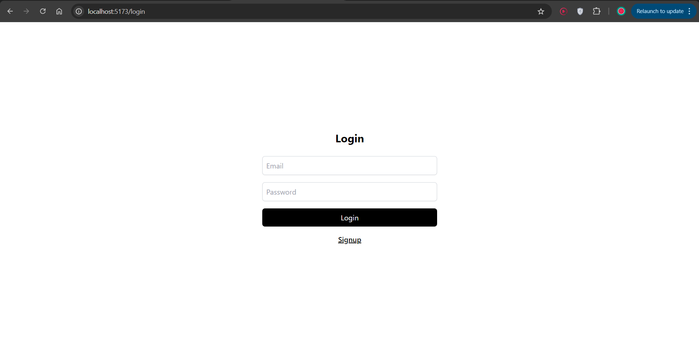
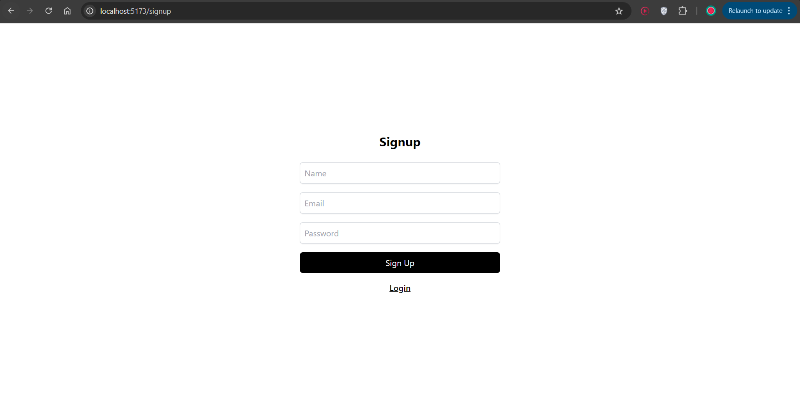
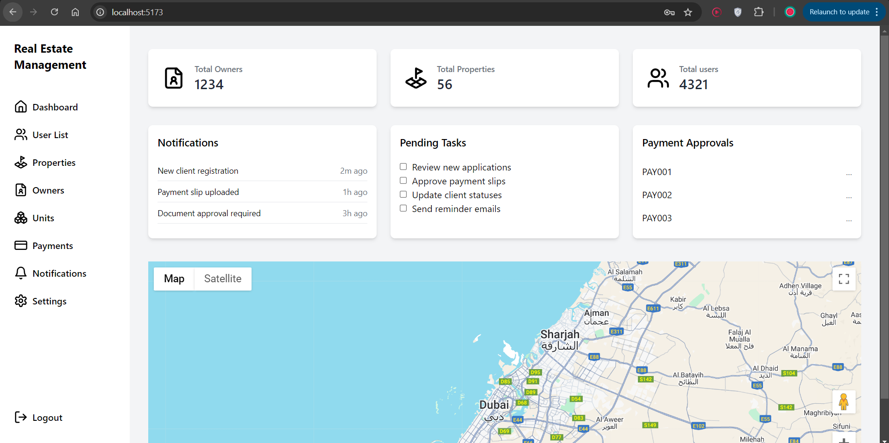
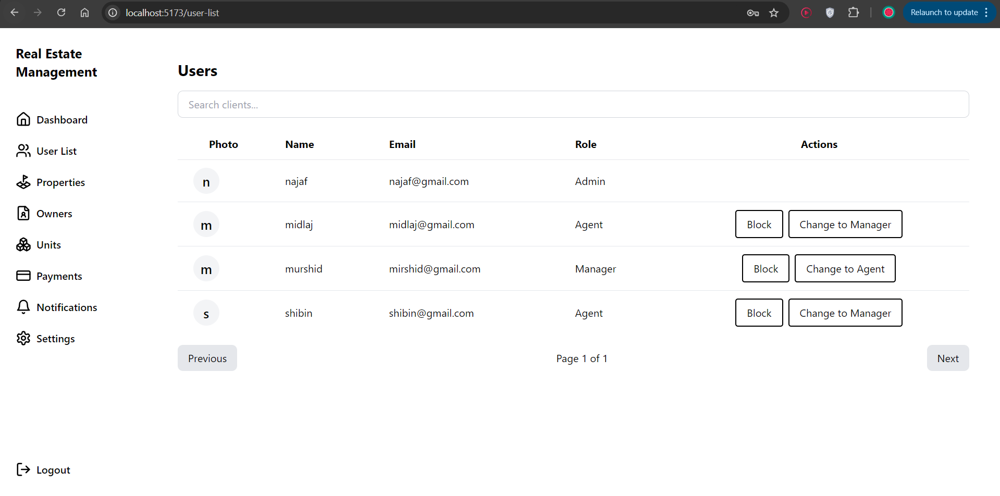
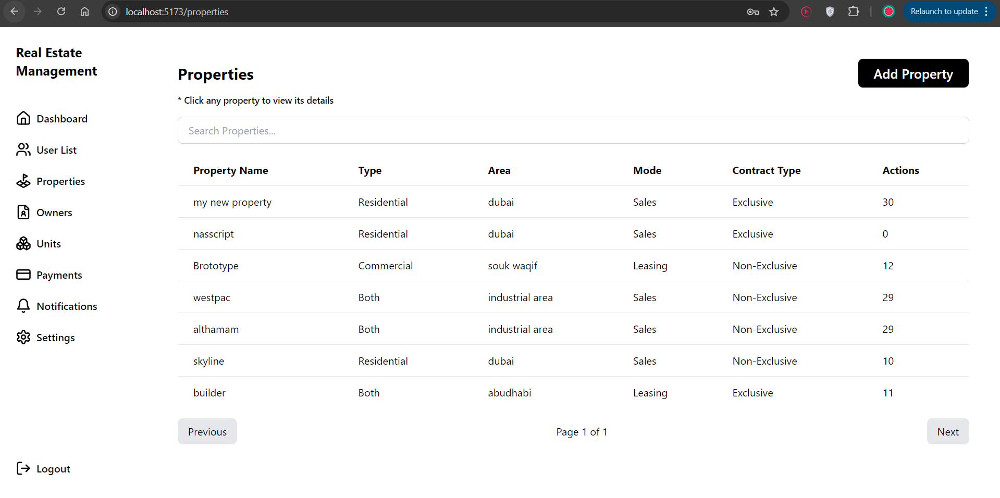
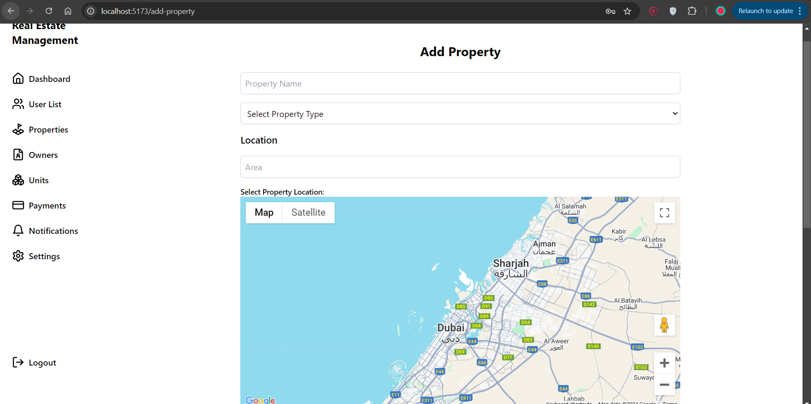

# Inventory Dashboard System

This project is an Inventory Dashboard for managing owners, properties, and units. Built using the MERN stack (MongoDB, Express, React, Node.js) and TypeScript, this system helps administrators track brokerage, sales, and leasing data. The Project has only started its journey and its nowhere near the completion. currently finished authetication(Role base Authentication Applied), Adding and viewing properties, Integrated Google maps for Property Tracking.

## Table of Contents

1. [Installation](#installation)
2. [Configuration](#configuration)
3. [Features](#features)
4. [Technologies](#technologies)
5. [API Endpoints](#api-endpoints)
6. [Contact Information](#contact-information)
7. [Screenshots/Demo](#screenshotsdemo)

## Installation

1. Clone the repository = git clone https://github.com/na-ja-f/real-estate-management.git
2. cd frontend
   -> npm install
   -> setip env file
   -> npm run dev
3. open new Terminal without closing existing terminal
4. cd server
   -> npm install
   -> npm run dev

## Configuration

Before running the application, you need to set up the environment variables for the backend. Follow these steps:

1. **Create a `.env` file** in the root directory of your backend server. This file will store sensitive configuration details.

2. **Add the following environment variables** to your `.env` file:

   ```plaintext
   PORT=4000
   MONGO_URI=mongodb+srv://<username>:<password>@cluster0.waxcppl.mongodb.net/real-estate-management
   JWT_SECRET=your_jwt_secret
   CLIENT_ORIGIN=http://localhost:5173


## features

1. User Authentication
   Signup: Users can create an account by providing email, password, and other required details.
   Login: Registered users can log in to the platform using their credentials.
   JWT Authentication: Authentication is secured using JSON Web Tokens (JWT), stored in secure HTTP-only cookies.
   Password Hashing: Passwords are securely hashed before storage using bcrypt.

2. Authorization and Role Management
   Role-based Access Control (RBAC): Admins, managers, and agents have different levels of access.
   Admin Privileges: Admin users have full control over the system, including managing users, properties, and financial details.
   Restricted Access: Agents and managers have limited access based on their roles, ensuring secure handling of data.

3. Dashboard
   Overview of Inventory: Admins and managers can view an overview of owners, properties, and units.
   Interactive Map: Displays the geographic distribution of available properties.

4. Property Management
   Add New Properties: Admins and managers can add properties with details such as name, type, location, and more.
   Property Types: Supports categories like Residential, Commercial, or Both.

## Technologies

🚀 Technologies Used

Frontend ---
React.js: JavaScript library for building interactive user interfaces, particularly Single Page Applications (SPAs).
React Router DOM: A declarative routing solution for React apps, enabling dynamic routing.
Redux Toolkit: The official, recommended approach to efficiently write Redux logic.
Redux Persist: Allows persisting the Redux store across sessions by saving it in storage.
React Hook Form: Provides efficient form validation with reduced re-renders.
Yup: Schema-based form validation used alongside React Hook Form.
@Hookform Resolvers: Integrates Yup for seamless form validation with React Hook Form.
Axios: Promise-based HTTP client to handle API requests.
Sonner: Lightweight and simple notification system for displaying alerts and messages.
Lucide-React: An open-source icon library for React with beautiful SVG-based icons.
@react-google-maps/api: A library for integrating Google Maps functionality in React applications.
TailwindCSS: A utility-first CSS framework for rapid UI development with fully customizable components.

Backend ---
Node.js: JavaScript runtime built on Chrome's V8 engine to execute JavaScript code server-side.
Express.js: Minimalist web framework for Node.js, providing robust routing and middleware.
Express Async Handler: Utility to simplify error handling in Express route handlers.
Express Validator: Middleware to validate and sanitize incoming request data.
Mongoose: An ODM (Object Data Modeling) library for MongoDB and Node.js.
MongoDB: NoSQL database for flexible, document-based data storage.
JWT (jsonwebtoken): A library for securely handling JSON Web Tokens for authentication.
Bcrypt.js: A password-hashing library to securely hash and validate user passwords.
Cors: Middleware for enabling Cross-Origin Resource Sharing to allow requests from different origins.
Dotenv: Module for managing environment variables through .env files.

Additional Tools --- 
TypeScript: Strongly-typed superset of JavaScript for enhanced code readability and tooling.


### API Endpoints

#### User Endpoints

| Method | Endpoint           | Description                                   |
|--------|--------------------|-----------------------------------------------|
| POST   | `/api/signup`      | Register a new user.                          |
| POST   | `/api/login`       | Login an existing user.                       |
| GET    | `/api/get-Users`   | Retrieve a list of all users (requires auth). |
| PATCH  | `/api/block-User`  | Block a user (requires auth).                |
| PATCH  | `/api/change-role`  | Change the role of a user (requires auth).  |

#### Property Endpoints

| Method | Endpoint                    | Description                                 |
|--------|-----------------------------|---------------------------------------------|
| POST   | `/api/property/add-property`         | Add a new property.                         |
| GET    | `/api/property/get-properties`       | Retrieve a list of all properties.         |
| GET    | `/api/property/get-property-detail/:id` | Get details of a specific property by ID.  |
| PUT    | `/api/property/update-property/:id`  | Update a specific property by ID.          |
| DELETE | `/api/property/delete-property/:id`  | Delete a specific property by ID.          |


## Contact Information

For questions, feedback, or support, please reach out:

- **Name**: Muhammad Najaf
- **Email**: najafnaju1983@gmail.com

Feel free to connect with me!


## Screenshots/Demo

  

  

  
*Overview of the Inventory Dashboard showing properties and units.*

  
*Form for adding a new property with all required fields.*

  
*Form for adding a new property with all required fields.*

  
*Form for adding a new property with all required fields.*
